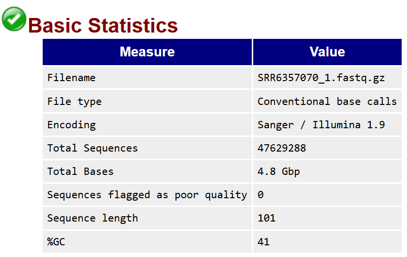
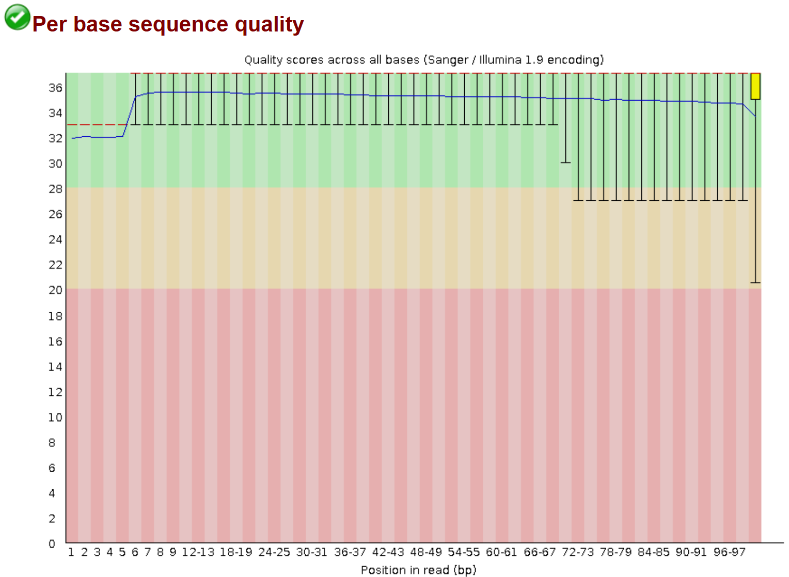
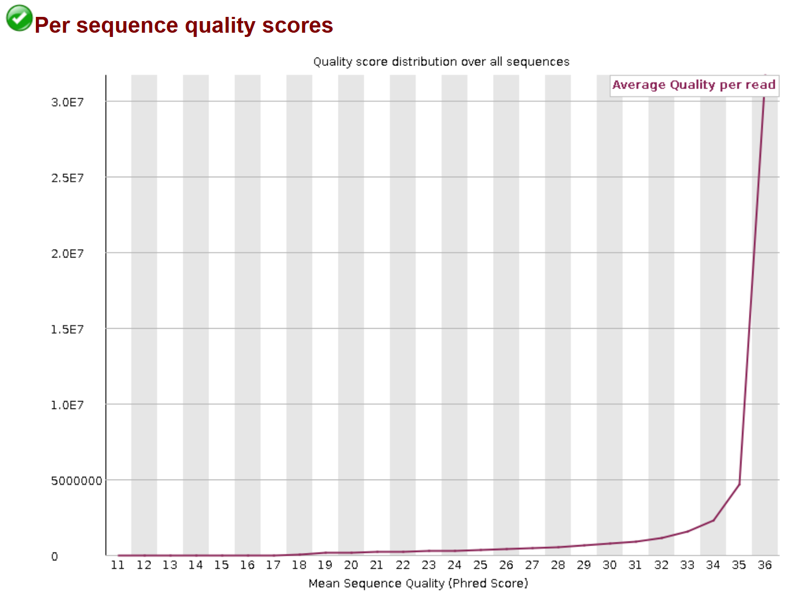
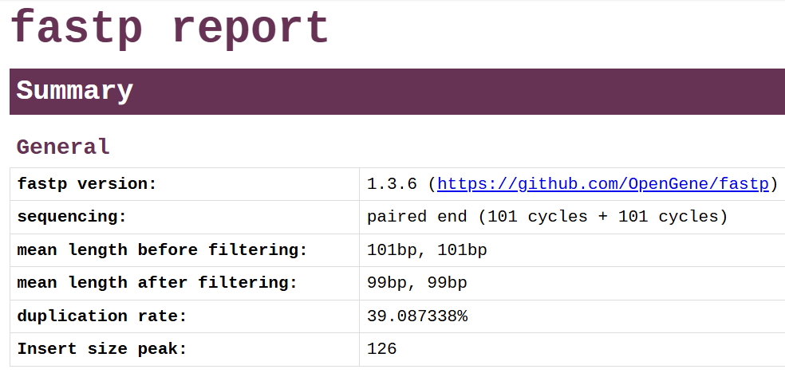
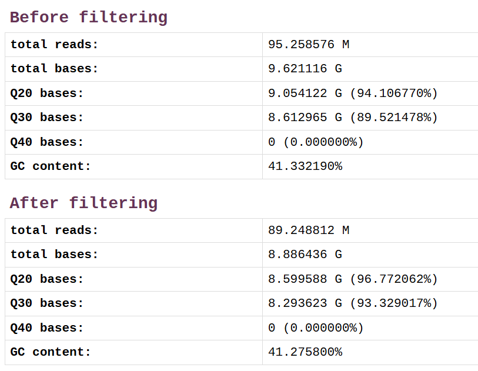
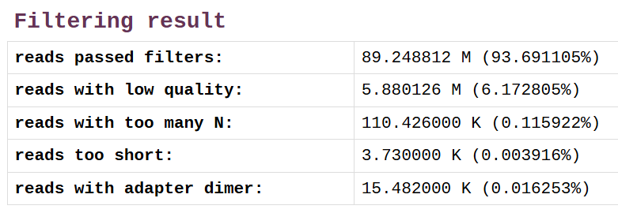
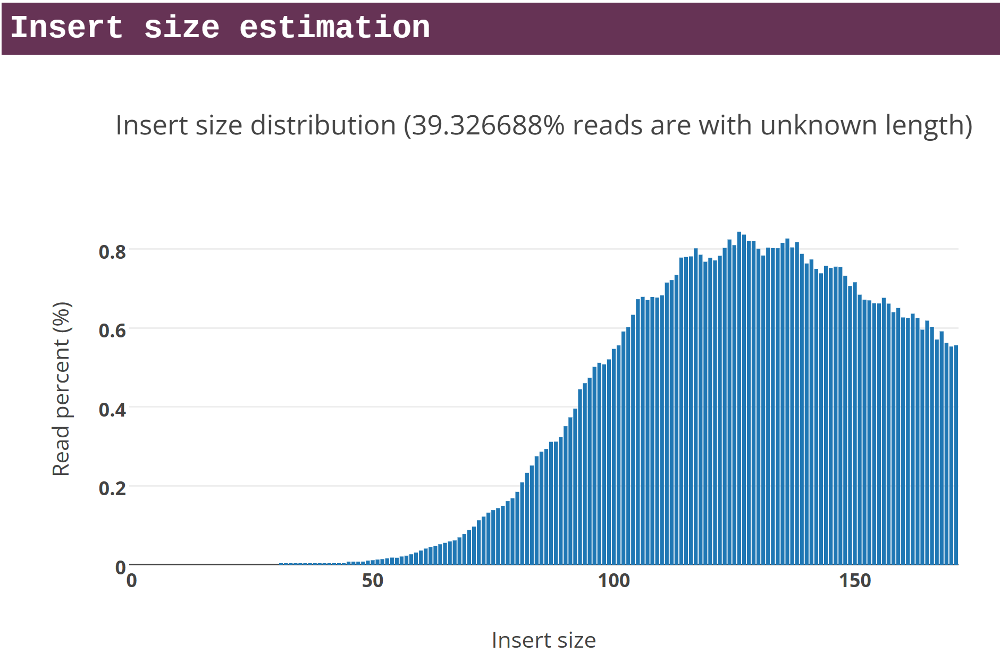
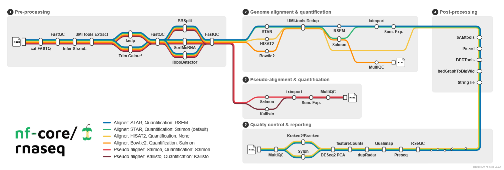

<!-- Reduce code font size in revealjs slides so code fits on a single slide -->
<style>
.reveal pre[class*="language-"],
.reveal code[class*="language-"],
.reveal .sourceCode,
.reveal .highlight {
  font-size: 0.75em !important;
  line-height: 1.1 !important;
}
</style>

# Visão geral da atividade prática {.divider style="text-align: center;"}

## Panorama de análises


::: {style="text-align: center; font-size: 0.7em;"}
*Bharti and Grimm, 2021.*
:::

## Recursos computacionais {.smaller}

::: {.incremental}
- Sistema Operacional: Linux Ubuntu / WSL2 (no Windows)
- Hardware: 
:::

## Dados da atividade prática {.smaller}

::: {.incremental}
- Dados de RNA-Seq de leveduras
- Wu et al. (2018):
- 
- 
:::

## Dados da atividade prática {.smaller}

::: {.incremental}
- Dados de RNA-Seq
  - Genoma de referência: *S. cerevisiae* (montagem R64-1-1, release 90)
  - Kits: TruSeq Stranded Total RNA kit e TruSeq stranded mRNA kit (strand-specific, "reverse")
  - Dados brutos de sequenciamento Illumina
  - Metadados associados às amostras
  - Paired-end
:::

# Download dos dados {.divider style="text-align: center;"}

## Sequence Read Archive no navegador


::: {style="text-align: center; font-size: 0.3em;"}
https://trace.ncbi.nlm.nih.gov/Traces/index.html?view=run_browser&acc=SRR1039519&display=download (acesso em 29/07/2026)
:::


## Linha de comando do Linux com SRA Toolkit

::: {.incremental}
- Download de dados brutos do NCBI
:::

## Linha de comando do Linux com SRA Toolkit - Executando

```bash
for srr in $(cat SraAccList.csv); do
    echo "Processing: $srr"
    fasterq-dump --split-files --threads 4 "$srr"
    gzip *fastq
    rm /home/renat/Software/sratoolkit.3.4.1-ubuntu64_cache/sra/*
done
```

# Explorando os metadados {.divider style="text-align: center;"}

## Metadados


# Análise de qualidade {.divider style="text-align: center;"}

## FastQC

FastQC v0.12.1

::: {.incremental}
- Download do executável
:::

## FastQC - Executando

```bash
# FastQC - Quality control for raw sequence data
fastqc SRR6357070_1.fastq.gz
fastqc SRR6357070_2.fastq.gz
```

## FastQC - Resultados (estatísticas gerais)




## FastQC - Resultados (qualidade por base)




## FastQC - Resultados (qualidade por sequência)




## MultiQC


# Limpeza dos dados de sequenciamento

## fastp

::: {.incremental}
- Download do executável
- Leituras pareadas 
- Mínimo de qualidade (20)
- Mínimo de comprimento (25)
:::

## fastp - download e permissão de execução

fastp 1.3.6

```bash
# download the latest build
wget http://opengene.org/fastp/fastp
chmod a+x ./fastp
```

## fastp - Executando

```bash
fastp --in1 SRR6357070_1.fastq.gz --in2 SRR6357070_2.fastq.gz \
  --out1 SRR6357070_1_clean.fastq.gz --out2 SRR6357070_2_clean.fastq.gz \
  --verbose --adapter_sequence AGATCGGAAGAGC --adapter_sequence_r2 AGATCGGAAGAGC \
  --qualified_quality_phred 20 --length_required 25 --thread 8 \
  --html SRR6357070_fastp.html
```

## fastp - Executando para múltiplas amostras com bash

```bash
for SAMPLE in SRR6357071 SRR6357072 SRR6357073 SRR6357074 SRR6357075 SRR6357076 SRR6357077 SRR6357078 SRR6357079 SRR6357080 SRR6357081 SRR6357082 SRR6357083 SRR6357084 SRR6357085 SRR6357086 SRR6357087
 do
 fastp --in1 "$SAMPLE"_1.fastq.gz --in2 "$SAMPLE"_2.fastq.gz \
  --out1 "$SAMPLE"_1_clean.fastq.gz --out2 "$SAMPLE"_2_clean.fastq.gz \
  --verbose --adapter_sequence AGATCGGAAGAGC --adapter_sequence_r2 AGATCGGAAGAGC \
  --qualified_quality_phred 20 --length_required 25 --thread 8 \
  --html "$SAMPLE"_fastp.html
done
```

## fastp - Resultados (estatísticas gerais)



## fastp - Resultados (estatísticas gerais)



## fastp - Resultados (estatísticas gerais)



## fastp - Resultados (estimativa de tamanho de inserto)



## FastQC - Executando em um loop após a limpeza (fastp)

```bash
for SAMPLE in SRR6357070 SRR6357071 SRR6357072 SRR6357073 SRR6357074 SRR6357075 SRR6357076 SRR6357077 SRR6357078 SRR6357079 SRR6357080 SRR6357081 SRR6357082 SRR6357083 SRR6357084 SRR6357085 SRR6357086 SRR6357087
 do
 fastqc "$SAMPLE"_1_clean.fastq.gz
 fastqc "$SAMPLE"_2_clean.fastq.gz
done
```


# Análise de contaminações em dados de RNA-Seq {.divider style="text-align: center;"}

## RiboDetector - instalando o software em ambiente conda

Quantificando o rRNA e removendo das próximas etapas com ribodetector 0.3.3.

```bash
conda create -n ribodetector python=3.10
conda activate ribodetector
pip install ribodetector
```

## RiboDetector - execução

Usando a versão do ribodetector que não usa GPU (`ribodetector_cpu`):

```bash
ribodetector_cpu -l 100 -t 6 -i SRR6357070_1_clean.fastq.gz SRR6357070_2_clean.fastq.gz \
  -o SRR6357070_1.nonrrna.fastq.gz SRR6357070_2.nonrrna.fastq.gz \
  -e rrna --chunk_size 256 --log SRR6357070_ribodetector.log
```

## RiboDetector - execução para múltiplas amostras

Usando a versão do ribodetector que não usa GPU (`ribodetector_cpu`):

```bash
#!/bin/bash

CONDA_BASE=$(conda info --base)
source "$CONDA_BASE/etc/profile.d/conda.sh"

conda activate ribodetector

for SAMPLE in SRR6357071 SRR6357072 SRR6357073 SRR6357074 SRR6357076 SRR6357077 SRR6357078 SRR6357079 SRR6357080 SRR6357081 SRR6357082 SRR6357083 SRR6357084 SRR6357085
 do
 ribodetector_cpu -l 100 -t 6 -i "$SAMPLE"_1_clean.fastq.gz "$SAMPLE"_2_clean.fastq.gz \
  -o "$SAMPLE"_1.nonrrna.fastq.gz "$SAMPLE"_2.nonrrna.fastq.gz \
  -e rrna --chunk_size 256 --log "$SAMPLE"_ribodetector.log
done

conda deactivate
```

# Mapeamento de dados de expressão no genoma de levedura

## HISAT2 - informações necessárias

::: {.incremental}
- HISAT2 versão 2.2.1
- Genoma no NCBI: GCF_000146045.2 (RefSeq)
  - Anotação (GTF): GCF_000146045.2_R64_genomic.gtf
  - Sequência genômica (FASTA): GCF_000146045.2_R64_genomic.fna
  - Sequências de RNAs (FASTA): 
- Leituras de RNA-Seq
:::

## HISAT2 - extraindo exons e sítios de splicing

```bash
hisat2_extract_exons.py GCF_000146045.2_R64_genomic.gtf > GCF_000146045.2_R64_genomic.exons
hisat2_extract_splice_sites.py -v GCF_000146045.2_R64_genomic.gtf > GCF_000146045.2_R64_genomic.ss
```

Saída:

```bash
genes: 6477, genes with multiple isoforms: 0
transcripts: 6477, transcript avg. length: 1380
exons: 6846, exon avg. length: 1306
introns: 369, intron avg. length: 307
average number of exons per transcript: 1
```

## HISAT2 - indexando o genoma

```bash
hisat2-build --exon GCF_000146045.2_R64_genomic.exons \
 --ss GCF_000146045.2_R64_genomic.ss -p 2 \
 GCF_000146045.2_R64_genomic.fna GCF_000146045.2_R64_genomic.fna
```


## HISAT2 - mapeando leituras de sequenciamento e verificando strandness

```bash
hisat2 -q --met-file SRR6357070_hisat2.metrics -p 8 \
 -x ../ref_genome/GCF_000146045.2/GCF_000146045.2_R64_genomic.fna \
 -1 ../yeast_data/SRR6357070_1.nonrrna.fastq.gz \
 -2 ../yeast_data/SRR6357070_2.nonrrna.fastq.gz -S SRR6357070_hisat2.sam
```

## AGAT

Another GFF Analysis Toolkit (AGAT) - Version: v0.8.0

```bash
conda create -n agat_env
conda activate agat_env
conda install -c bioconda agat
```

Gerando um arquivo BED12:

```bash
agat_convert_sp_gff2bed.pl --gff GCF_000146045.2_R64_genomic.gff -o GCF_000146045.2_R64_genomic.bed
```

## RSeQC

```bash
pip install RSeQC
```

infer_experiment.py 5.05

```bash
infer_experiment.py -i SRR6357070_hisat2.sam -r ../ref_genome/GCF_000146045.2/GCF_000146045.2_R64_genomic.bed -s 400000
```

Esperado para Illumina TruSeq: `1+-,1-+,2++,2--`:

```bash
Reading reference gene model ../ref_genome/GCF_000146045.2/GCF_000146045.2_R64_genomic.bed ... Done
Loading SAM/BAM file ...  Total 400000 usable reads were sampled

This is PairEnd Data
Fraction of reads failed to determine: 0.0034
Fraction of reads explained by "1++,1--,2+-,2-+": 0.0072
Fraction of reads explained by "1+-,1-+,2++,2--": 0.9894
```

bam_stat.py 5.05

```bash
bam_stat.py -h
```

```bash
Load BAM file ...  Done

#==================================================
#All numbers are READ count
#==================================================

Total records:                          125143097

QC failed:                              0
Optical/PCR duplicate:                  0
Non primary hits                        36838107
Unmapped reads:                         3106438
mapq < mapq_cut (non-unique):           8669981

mapq >= mapq_cut (unique):              76528571
Read-1:                                 38250123
Read-2:                                 38278448
Reads map to '+':                       38263663
Reads map to '-':                       38264908
Non-splice reads:                       74866883
Splice reads:                           1661688
Reads mapped in proper pairs:           75413158
Proper-paired reads map to different chrom:0
```

## HISAT2 - mapeando leituras de sequenciamento

```bash
hisat2 -q --met-file SRR6357070_hisat2.metrics -p 8 --rna-strandness RF \
 -x ../ref_genome/GCF_000146045.2/GCF_000146045.2_R64_genomic.fna \
 -1 ../yeast_data/SRR6357070_1.nonrrna.fastq.gz \
 -2 ../yeast_data/SRR6357070_2.nonrrna.fastq.gz -S SRR6357070_hisat2.sam
```

*Quantificação com HTSeq

## Kraken2

*Extra: análise de contaminações com o banco de dados PlusPFP


# Quantificação da expressão {.divider style="text-align: center;"}

## RSEM

RSEM-1.3.3. Instalação com `make`, seguindo o guia no [Github] (ttps://github.com/deweylab/RSEM)

```bash
make
```

Executáveis para Linux 64x foram baixados do [repositório do Github](https://github.com/benlangmead/bowtie2).

## RSEM - preparando as sequências de referência

```bash
rsem-prepare-reference --gtf ../ref_genome/GCF_000146045.2/GCF_000146045.2_R64_genomic.gtf \
 --bowtie2 -p 4 ../ref_genome/GCF_000146045.2/GCF_000146045.2_R64_genomic.fna GCF_000146045.2_R64_genomic
```

## RSEM - quantificando a expressão

```bash
rsem-calculate-expression --strandedness reverse -p 4 --bowtie2 \
 --no-bam-output  --paired-end \
 ../yeast_data/SRR6357070_1.nonrrna.fastq.gz ../yeast_data/SRR6357070_2.nonrrna.fastq.gz \
 GCF_000146045.2_R64_genomic SRR6357070
```

## RSEM - quantificando a expressão de várias amostras (fastp)

*O ideal seria fazer a quantificação com os dados após a limpeza do ribossomal (como no exemplo acima).

```bash

```

## Salmon

Salmon 2.0

```bash
conda create -n salmon_env
conda activate salmon_env
conda install -c bioconda -c conda-forge salmon
```


## Salmon - criando o índice com transcritos

Usando transcritos gerados com RSEM:

```bash
salmon index --transcripts ../quantifying_expression/GCF_000146045.2_R64_genomic.transcripts.fa --index index
```

## Salmon - quantificando a expressão


```bash
salmon quant -l A --index index/ --output SRR6357070_quant \
 -1 ../yeast_data/SRR6357070_1.nonrrna.fastq.gz \
 -2 ../yeast_data/SRR6357070_2.nonrrna.fastq.gz \
 -p 2 --numBootstraps 100 --seqBias --gcBias
```

## Salmon - quantificando a expressão de várias amostras (resultados do fastp)

*O ideal seria fazer a quantificação com os dados após a limpeza do ribossomal (como no exemplo acima).

```bash
#!/bin/bash

CONDA_BASE=$(conda info --base)
source "$CONDA_BASE/etc/profile.d/conda.sh"

conda activate salmon_env

for SAMPLE in SRR6357070 SRR6357071 SRR6357072 SRR6357073 SRR6357074 SRR6357075 SRR6357076 SRR6357077 SRR6357078 SRR6357079 SRR6357080 SRR6357081 SRR6357082 SRR6357083 SRR6357084 SRR6357085 SRR6357086 SRR6357087
 do
 #ls ../yeast_data/"$SAMPLE"_1_clean.fastq.gz ../yeast_data/"$SAMPLE"_2_clean.fastq.gz
 salmon quant -l A --index index/ --output "$SAMPLE"_quant \
 -1 ../yeast_data/"$SAMPLE"_1_clean.fastq.gz \
 -2 ../yeast_data/"$SAMPLE"_2_clean.fastq.gz \
 -p 2 --numBootstraps 100 --seqBias --gcBias
done

conda deactivate
```

## Salmon - gerando a matriz de contagens

Selecionando a linhagem Rap1-AID degron com e sem indução (2 horas) e sequenciamento poliA (SRR6357082, SRR6357083, SRR6357084, SRR6357085, SRR6357086 e SRR6357087), para a geração de matriz de contagens:

```bash
salmon quantmerge --quants SRR6357082_quant SRR6357083_quant SRR6357084_quant SRR6357085_quant SRR6357086_quant SRR6357087_quant --names SRR6357082 SRR6357083 SRR6357084 SRR6357085 SRR6357086 SRR6357087 -c numreads -o polia_rap1aid_contagens.tsv
```


# Expressão diferencial de genes {.divider style="text-align: center;"}

## DESeq2 - instalação

Pacote para testes de expressão diferencial.

```bash
if (!require("BiocManager", quietly = TRUE))
    install.packages("BiocManager")

BiocManager::install("DESeq2")
```

## apeglm - instalação

Pacote para estimar o tamanho do efeito "encolhido".

O apeglm (Zhu, Ibrahim, e Love, 2018) é recomendado no guia oficial do DESeq2.

```bash
if (!require("BiocManager", quietly = TRUE))
    install.packages("BiocManager")

BiocManager::install("apeglm")
```

## EdgeR - instalação

Pacote para testes de expressão diferencial.

```bash
if (!require("BiocManager", quietly = TRUE))
    install.packages("BiocManager")

BiocManager::install("edgeR")
```


## Sua vez {background-color="#3D6B4A"}

[Exercício · 5 minutos]{.eyebrow}

1. 

```{r}
#| echo: false
# install.packages("countdown")
countdown::countdown(minutes = 5, seconds = 0, top = 0, right = 0)
```

## Alternativas {.smaller}

[Nextflow [nf-core/rnaseq](https://github.com/nf-core/rnaseq)]{style="text-align: center; display: block;"}



::: {style="text-align: center; font-size: 0.7em;"}
Imagem do repositório nf-core/rnaseq
:::


## Para a próxima semana {.smaller}

- Relatório de aula prática


## Referências e recursos {.smaller}

- Bharti and Grimm. **Design and Analysis of RNA Sequencing Data.** Next Generation Sequencing and Data Analysis. Cham: Springer International Publishing, 2021. 143-175. [BookChapter RNA-Seq Analyses](https://github.com/grimmlab/BookChapter-RNA-Seq-Analyses)
- *Dados de leveduras*: [Wu, Andrew CK, et al.](https://www.cell.com/molecular-cell/fulltext/S1097-2765(18)30878-5) **Repression of Divergent Noncoding Transcription by a Sequence-Specific Transcription Factor.** Molecular Cell 72 (2018): 942-954.
