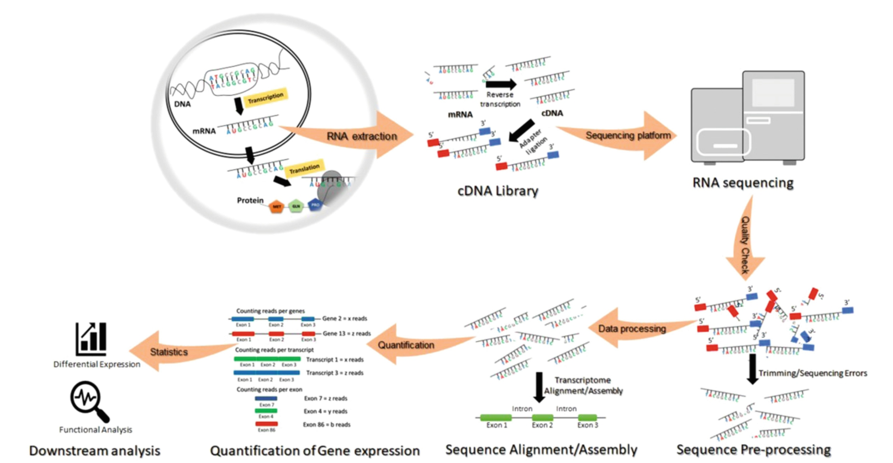
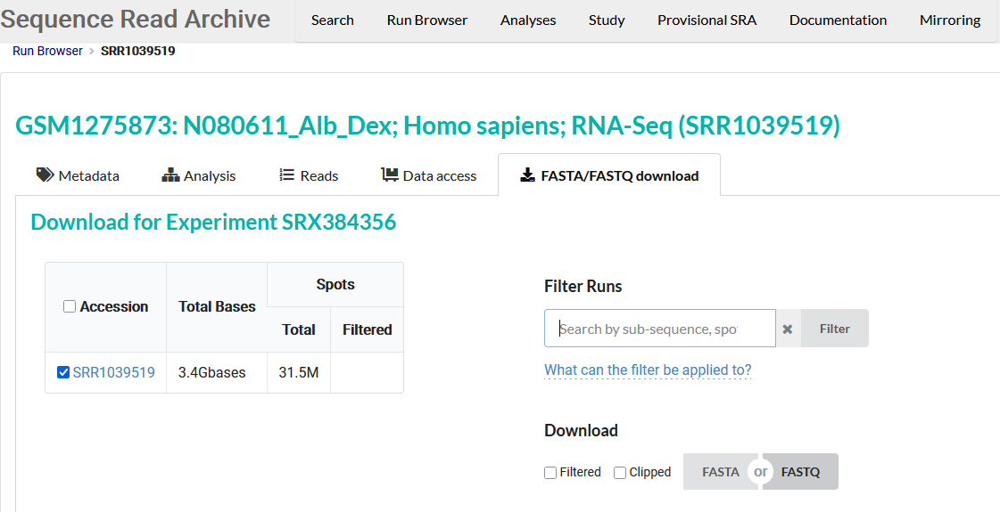

# Visão geral da atividade prática {.divider style="text-align: center;"}

## Panorama de análises



::: {style="text-align: center; font-size: 0.7em;"}
*Bharti and Grimm, 2021.*
:::

## Recursos computacionais {.smaller}

::: {.incremental}
- Sistema Operacional: Linux Ubuntu / WSL2 (no Windows)
- Hardware: 
:::

## Dados da atividade prática {.smaller}

::: {.incremental}
- Dados de humanos: Himes et al. (2014)
  - Genoma de referência: 
  - Dados brutos de sequenciamento: 
  - Metadados associados às amostras: 
- Dados de leveduras: Wu et al. (2018)
  - Genoma de referência: 
  - Dados brutos de sequenciamento: 
  - Metadados associados às amostras:
:::

::: {.notes}
Notas do apresentador ficam aqui e aparecem só na sua tela (tecla S).
Lembrar: pedir para abrirem o RStudio ou VS Code antes de começar.
:::

# Download dos dados {.divider style="text-align: center;"}

## Sequence Read Archive no navegador



::: {style="text-align: center; font-size: 0.3em;"}
https://trace.ncbi.nlm.nih.gov/Traces/index.html?view=run_browser&acc=SRR1039519&display=download (acesso em 29/07/2026)
:::


## Linha de comando do Linux com SRA Toolkit

::: {.incremental}
- Referência: 
- Versão: 
:::

## Linha de comando do Linux com SRA Toolkit - Executando

```bash
XXXX
```

# Explorando os metadados {.divider style="text-align: center;"}

## Metadados


# Análise de qualidade {.divider style="text-align: center;"}

## FastQC

::: {.incremental}
- Referência: 
- Versão: 
:::

## FastQC - Executando

```bash
# FastQC - Quality control for raw sequence data
fastqc 
```


## MultiQC


## RSeQC


# Limpeza dos dados de sequenciamento

## fastp


## cutadapt


# Análise de contaminações em dados de RNA-Seq {.divider style="text-align: center;"}

## HISAT2 


## Kraken2


## Sua vez {background-color="#3D6B4A"}

[Exercício · 5 minutos]{.eyebrow}

1. 

```{r}
#| echo: false
# install.packages("countdown")
countdown::countdown(minutes = 5, seconds = 0, top = 0, right = 0)
```

## Para a próxima semana {.smaller}

- Relatório de aula prática


## Referências e recursos {.smaller}

- Bharti and Grimm. **Design and Analysis of RNA Sequencing Data.** Next Generation Sequencing and Data Analysis. Cham: Springer International Publishing, 2021. 143-175. [BookChapter RNA-Seq Analyses](https://github.com/grimmlab/BookChapter-RNA-Seq-Analyses)
- *Dados de humanos*: Himes, Blanca E., et al. **RNA-Seq transcriptome profiling identifies CRISPLD2 as a glucocorticoid responsive gene that modulates cytokine function in airway smooth muscle cells.** PloS one 9.6 (2014): e99625.
- *Dados de leveduras*: Wu, Andrew CK, et al. **Repression of Divergent Noncoding Transcription by a Sequence-Specific Transcription Factor.** Molecular Cell 72 (2018): 942-954.
